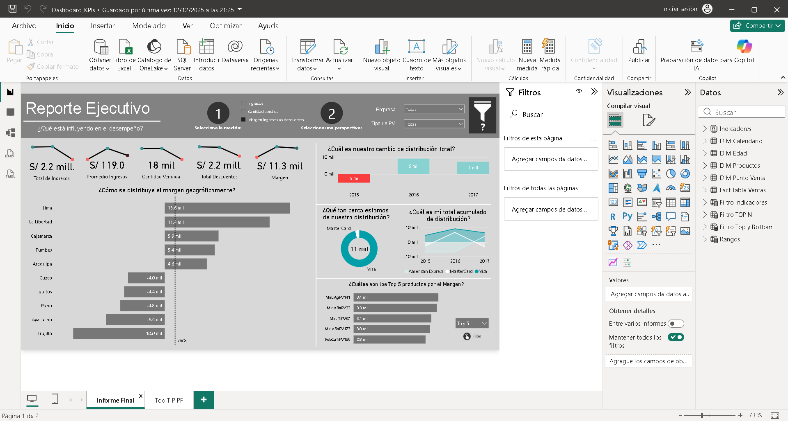

# Power BI Dashboard (KPIs y Filtros)

Dashboard interactivo en Power BI para análisis descriptivo y visualización de KPIs.

## Qué incluye
- KPIs principales (resumen ejecutivo)
- Segmentadores / filtros
- Gráficos comparativos y de tendencia

## Tecnologías
- Power BI (.pbix)

## Cómo usar
1) Descargar el archivo `.pbix`
2) Abrirlo con Power BI Desktop
3) Explorar filtros y visualizaciones

## Evidencia

**Reporte ejecutivo**

**Modelo / Tablas**

